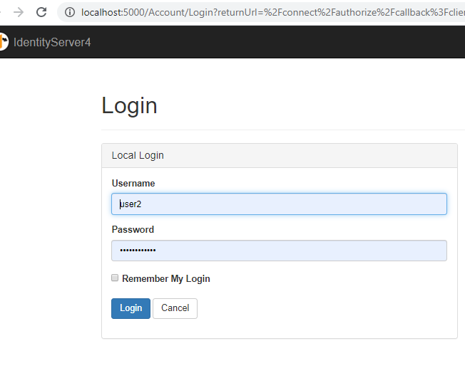

# Sample
**Simple Product managment**
.Net Core MVC & API applcation based on Microservices architecture style secured with IdentityServer4 as IDP.

# Requirements:
To develop simple Product management application (Business objectives, Background, Scope, Features etc.
  To-Do 
* Funtional Requerment specification (FRS/SRS)
* Non-Functional (QA) Requirement specification
* Architecture requirements specification
* Business Context using DDD

# Application Details:
## Reference Architecture:

  Image Source: - [docs.microsoft.com](https://docs.microsoft.com/en-us/azure/architecture/guide/architecture-styles/microservices)

## Technologies:
### prerequisites:
1. Visual Studio 2019
1. .Net Framework
    * .Net Core 3.0 SDK
    * .Net Core 3.1 SDK
 1. SQL Server 2019 Express 2019 or higher
### Back-End:
1. .NET Core Web API
1. API Documentation - Open API
    * Swagger + Swashbuckle
1. Identity Server 4
1. Entity Framework Core
### Front-End:
 1. .NET Core MVC
 1.  Angular9UI SPA - WIP or incomplete

### Database - Polyglot persistance:
   1. *SQLite - Embedded RBDMS for Identity Microservices
   1. *MSSQL- RBMS as Trasaction DB for Product Microservice.
 

# Build/Run Application:
1. See that you have installed the .Net Core 3.0 and .Net Core 3.1.
1. Run the scrit **TestInnom.Database/Scripts/TestInnomDB_Create.sql** to create Database in SQL server (Or you can user TestInnomDB.bak to restore the DB)
1. Open Solution (TestInnom.sln) in the Visual Studio and restore the nuget packages for all the projects. 
1. Build the Solution and see if we have any errors.
1. Set the following projects as the Startup projects. and Press F5 to run the application. Right Click on Solution --> Set StartUp Projects --> window will be open --> Click on Multiple Startup Projects radio button --> In action colomn select Start/Start without debugging for the following.
    * TestInnom.Identity
    * TestInnom.Product.API
    * TestInnom.MVC
1. Goto MVC UI application (http://localhost:5002) which will be redirected to IDP's Login screen (Which uses Oauth 2.0  and OIDC implicit/Hybrid flow for Authentication/Authorization). you can use following users
    * user1/Password@123   -- Admin - can access all the pages
    * user1/Password@123   -- user - Cannot access the Claims page.
 1. You can sceen the Dash board with Products Grid. Still need to implement the CRUD operation on the Product, only grid load is only implemented for now.

# URLs:
### MVC UI
* http://localhost:5002
### Product Services
* http://localhost:5050/swagger -- API document
### Identity Service
* http://localhost:5000/swagger -- API document
* http://localhost:5000/Admin  -- AdminUI for IDP Community edition
### AngularUI -- not working
* http://localhost:4200

# To-Do
1. API Gateway - Ocelot
1. Event Driven Architecture
    *  Message-Brokers like RabbitMQ/ActiveMQ with AsyncAPI documentation
1. CQRS with Event Sourcing or MediatR
1. Tests
    * [Unit tests]
    * [Integration tests]
1. Resiliency with Polly - transient-fault-handling 
1. Caching - Redis
1. gRPC
1. Fluent Validation
1. Cake for building Or DevOps with VSTS
1. Polyglot persistance
1. Cross cutting concerns
1. SignalR for realtime
1. update the solution to use container (Docker support) and Azure Pass
1. etc.

# ScreenShots:
### Solution screens

### MVC UI

### IDP

### Products Microservice

